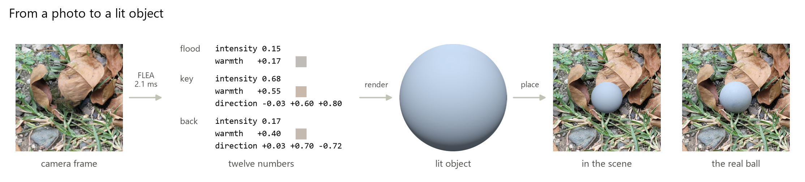
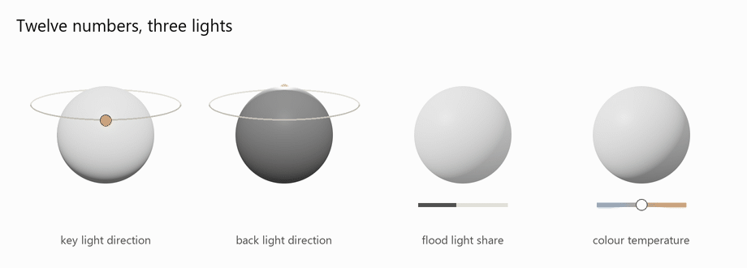
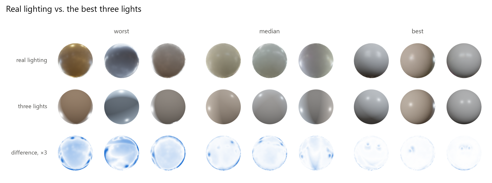
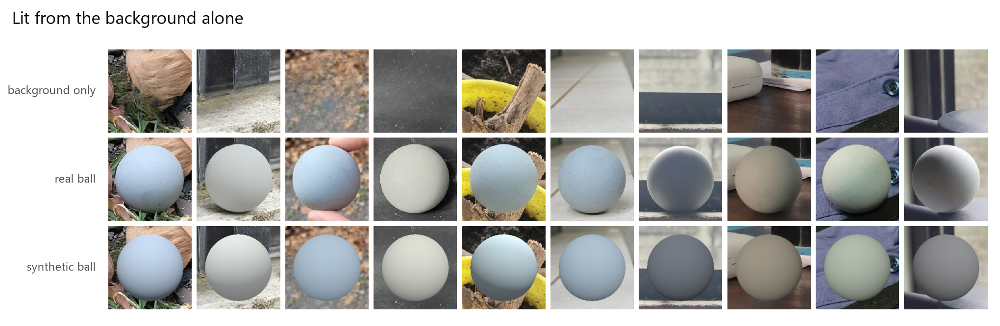

# FLEA: Fast Lighting Estimation for AR

| | |
|---|---|
| **2.1 ms** per frame on one CPU core | camera frame in, lights out, through ONNX Runtime |
| **8.5 ms** in a browser tab | ONNX Runtime Web on WebAssembly, one thread |
| **4.1 MB** model | MobileNetV3-Small, 1.08M parameters, 55M multiply-adds |
| **12 numbers** out | a flood, a key and a back light, the lights a game engine already has |
| **52.2%** of a real ball's shading reproduced | from phone photos; the best constant manages 29.2% |
| **0** measured lighting labels | trained on rendered scenes and real photos it labelled itself |

**Have you ever played an augmented reality game like Pokémon GO and thought: can you imagine if it understood the lighting?** A Pokémon on your desk would be lit by the same lamp as the mug next to it, from the same side, in the same warm colour. That thought is what started this project, and it's where FLEA comes in.

FLEA looks at the scene with the ball edited out and returns twelve numbers in 2.1 ms. A ball rendered under those numbers goes where the real one was, and the real ball is on the right for comparison.

---

## The problem

Putting a virtual object into a live camera feed is mostly a lighting problem. Phones are already good at finding the floor and tracking the camera. What gives a virtual object away is light from the wrong direction, at the wrong brightness or in the wrong colour. It ends up looking like a sticker.

I wanted a model small enough to run on the device that took the photo, returning lighting in the form a game engine already understands.

**Can a model that small read the light well enough to fool you?**

That's the question I wanted to answer.

## "Twelve numbers? Real lighting is way more complicated than that."

It is. FLEA describes all of it with twelve numbers, three lights' worth:

| light | its numbers | what it does |
|---|---|---|
| flood | intensity, colour temperature | soft light from every direction, which fills in the shadows |
| key | direction (3 numbers), intensity, colour temperature | the main light: which side is bright and where the shadow falls |
| back | direction (3 numbers), intensity, colour temperature | light from behind, which draws a bright rim along the edge |

That's 2 + 5 + 5. The three intensities are shares of the total light, because a photo's auto-exposure hides how bright the room really is. Every scene FLEA looks at, from a sunny park to a desk lamp, comes out as those twelve values.

So the first thing I measured was how much real lighting twelve numbers can hold at all. I rendered a ball under 24 real HDR environments, turned to 8 different angles each, and fitted the twelve numbers to every render directly, with the answer in hand. No model working from a single photo can beat that fit. I also wrote the decision down before running it: if the fit explained less than 85% on average, the rig would get a fourth light or a spherical-harmonic ambient term.

The top row is the ball under real lighting, the middle row is the best twelve numbers, and the bottom row is the difference between the two, amplified three times so it's visible.

**Twelve numbers, fitted well, explain 91.4% of how the ball is shaded under real lighting.** The median is 92.5% and the worst case is 73.2%, across 192 fits. That's the headroom a model has to work with, and it's why the rig stayed at three lights.

What surprised me was where the misses come from. The angle matters far more than the room: differences between angles of the same room account for 88% of the variation in fit quality, and one lounge fits at 97.5% from one side and 73.2% from another.

## "Where do you even get the right answers to train on?"

You can't label lighting by looking at a photo. Measuring it properly means putting a mirror ball or a 360° camera in the scene at the moment the photo is taken, which is why real lighting datasets are small and expensive.

So I rendered the training data instead. When the renderer lights a scene, it knows exactly where every light is, because it put them there. FLEA trains on 100,604 rendered frames from a library of 1,383 3D models of everyday objects: some frames hold one object, some are cluttered with several at any size, and some hold none.

Rendered frames only get you so far, so half of every training batch is real: 7,105 photographs of everyday scenes, labelled by an earlier version of FLEA. Not one training image carries a measured lighting label.

---

## Summary

FLEA looks at one camera frame and returns those twelve numbers. They're the same vocabulary a game engine already uses, so the output lights a virtual object directly.

The network is a MobileNetV3-Small with a regression head, **1.08M parameters and a 4.1 MB file.** Exported to ONNX, it goes from a camera frame to the lights in **2.1 ms on a single laptop CPU core**, and runs in **8.5 ms inside a browser tab.**

On ten phone photos of a real ball, a ball rendered under FLEA's estimate reproduces **52.2%** of the real ball's shading.

| | shading reproduced |
|---|---:|
| Best constant: one set of lights for all ten photos, fitted with the answers in hand | 29.2% |
| **FLEA** | **52.2%** |
| Ceiling: three lights fitted to each photo directly | 85.2% |

FLEA beats the constant on 9 of the 10 photos.

Two ideas do most of the work here.

**Twelve numbers instead of a panorama.** An HDR environment map is thousands of values. Predicting the rig directly is what keeps the model at 2 ms, and it's the form a real-time engine's lights take anyway.

**Every number sits next to the best constant.** A lighting model that learned nothing but the average room can still post respectable raw numbers. So every result here is reported next to the single best guess that ignores the image, and the gap between the two is the headline.

---

## Results

### Speed

**About 2 ms per frame on one CPU core, and 8.5 ms in a browser.**

| | median |
|---|---:|
| ONNX Runtime, one CPU core | 2.1 ms |
| ONNX Runtime, all cores | 1.5 ms |
| ONNX Runtime Web in Chromium, WebAssembly, one thread | 8.5 ms |

The native timings run from a 640×480 camera frame to the 12 numbers, covering the crop, the resize and the network, one frame at a time on an Intel i7-13620H laptop. The browser timing is the network inside a page served the way a static web demo is, where WebAssembly gets a single thread. The exported model ends in the 12 values, so a demo reads the lights straight from its output.

At 30 fps a frame lasts 33 ms, so one estimate takes 6% of a frame on one core. Lighting in a room changes slowly, so a renderer only needs a fresh estimate a few times a second. And since the output is a set of lights the engine renders with anyway, the estimate is the whole cost. MobileNetV3 came out of a search for networks that run fast on phone CPUs, and this is the size it was built for.

### On synthetic held-out data

388 rendered scenes built from 3D models the network never saw in training, each rendered twice under the same lighting: once with the object centred, and once with objects anywhere in the frame.

| | object centred | objects anywhere | best constant |
|---|---:|---:|---:|
| key light direction | 31.7° | 38.1° | 49.3° |
| flood intensity | 0.113 | 0.123 | 0.183 |
| key intensity | 0.128 | 0.135 | 0.164 |
| colour temperature | 0.250 | 0.254 | 0.404 |

Intensity and colour temperature are in the model's normalized units. Lower is better.

### On real photographs

FLEA has never seen a measured lighting label. Here's what happens when you show it real scenes:

The top row is each scene with the ball edited out. The middle row is the original photo. In the bottom row, a synthetic ball sits where the real one was, lit only by what FLEA estimated from the scene without the ball. Its colour is copied from the real ball, since the phone's white balance leaves colour unmeasured, so what you're comparing is the shading.

---

## Status quo

Estimating lighting for AR isn't new. Today it lives in three places.

**Phone AR platforms.** The platforms AR games are built on estimate lighting inside their AR sessions. Apple's [ARKit](https://developer.apple.com/documentation/arkit/arlightestimate) reports a scene's overall brightness and colour temperature, and a [primary light direction when it's tracking a face](https://developer.apple.com/documentation/arkit/ardirectionallightestimate). Google's [ARCore](https://developers.google.com/ar/develop/lighting-estimation) goes further in its Environmental HDR mode, with a main directional light, ambient spherical harmonics and an HDR cubemap for reflections.

**Research models.** [Gardner et al.](https://arxiv.org/abs/1704.00090) predict a full HDR environment map from a single photo, and [later a set of parametric lights](https://arxiv.org/abs/1910.08812). [LeGendre et al.](https://arxiv.org/abs/1904.01175) learn lighting for mobile mixed reality from reflective spheres filmed on a phone, and [Garon et al.](https://arxiv.org/abs/1906.03799) estimate lighting that changes across a room. These models are built for accuracy first, and they return far more than a real-time renderer needs.

**The web.** WebXR has a [Lighting Estimation module](https://www.w3.org/TR/webxr-lighting-estimation-1/) that passes estimates to web pages running an AR session. It's still a W3C working draft.

FLEA needs a camera frame and nothing else: no AR session and no platform API. The same 4.1 MB file returns the lights in 2 ms natively or 8.5 ms in a browser tab, as three lights every game engine already renders.

## Practical applications

- **AR games and filters.** A character lit from the same side as the room around it, updating as the player walks from a window into a hallway.
- **Shopping in AR.** A sofa, a lamp or a pair of shoes previewed in your own room under your own light, from a browser tab.
- **Video and photo compositing.** A rendered object placed into footage starts from the shot's own key direction, fill level and colour.
- **Live streams and video calls.** Virtual props and overlays lit like the person holding them, at 2 ms a frame.
- **Games on low-power hardware.** Twelve numbers drive three standard lights, so any engine can use the estimate without a custom shading path.

---

## About this repository

The implementation, the training pipeline and the trained weights are private for now while I prepare the work for publication. I'm happy to walk through them.

Two small, self-contained pieces are here:

| Path | What it does |
|---|---|
| [`flea/framing.py`](flea/framing.py) | the framing rule shared by training and inference, so a real object is cropped the same way the training data was |
| [`flea/checkpoint.py`](flea/checkpoint.py) | atomic checkpoint saves |

---

## References

**Lighting estimation**

- Gardner, M.-A., Sunkavalli, K., Yumer, E., Shen, X., Gambaretto, E., Gagné, C., & Lalonde, J.-F. (2017). **Learning to Predict Indoor Illumination from a Single Image.** *ACM Transactions on Graphics (SIGGRAPH Asia)*. [[arXiv:1704.00090]](https://arxiv.org/abs/1704.00090)
- Gardner, M.-A., Hold-Geoffroy, Y., Sunkavalli, K., Gagné, C., & Lalonde, J.-F. (2019). **Deep Parametric Indoor Lighting Estimation.** *ICCV*. [[arXiv:1910.08812]](https://arxiv.org/abs/1910.08812)
- LeGendre, C., Ma, W.-C., Fyffe, G., Flynn, J., Charbonnel, L., Busch, J., & Debevec, P. (2019). **DeepLight: Learning Illumination for Unconstrained Mobile Mixed Reality.** *CVPR*. [[arXiv:1904.01175]](https://arxiv.org/abs/1904.01175)
- Garon, M., Sunkavalli, K., Hadap, S., Carr, N., & Lalonde, J.-F. (2019). **Fast Spatially-Varying Indoor Lighting Estimation.** *CVPR*. [[arXiv:1906.03799]](https://arxiv.org/abs/1906.03799)

**AR platforms**

- Apple. **ARLightEstimate** and **ARDirectionalLightEstimate.** *ARKit documentation*. [[ARLightEstimate]](https://developer.apple.com/documentation/arkit/arlightestimate) [[ARDirectionalLightEstimate]](https://developer.apple.com/documentation/arkit/ardirectionallightestimate)
- Google. **Get the lighting right.** *ARCore documentation*. [[lighting estimation]](https://developers.google.com/ar/develop/lighting-estimation)
- W3C Immersive Web Working Group. **WebXR Lighting Estimation API Level 1.** *First Public Working Draft*. [[w3.org]](https://www.w3.org/TR/webxr-lighting-estimation-1/)

**Architecture**

- Howard, A., et al. (2019). **Searching for MobileNetV3.** *ICCV*. [[arXiv:1905.02244]](https://arxiv.org/abs/1905.02244)

**Data**

- [**Poly Haven**](https://polyhaven.com). HDR environment maps, released under CC0. The real lighting in the three-light experiment.

---

## License

All rights reserved. The two files in `flea/` are here to read.
